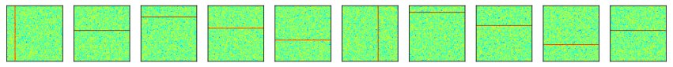

# Psychometric functions
- In this project, I will train a convolutional neural network on Gaussian noise with horizontal or vertical lines.
- The neural network will learn to classify the Gaussian noise based on whether they have horizontal or vertical lines.
- Then, I will give the trained network Gaussian noise with lines that are not perfectly horizontal or vertical, and see how the network does.
- [I've linked the original colab notebook here.](https://colab.research.google.com/drive/1qrz7N6MREYYKZ2z3Rb6ItKd1OOqZ7Ya8?usp=sharing)
- This is my unique solution to a problem from Mike X Cohen's a Deep Understanding of Deep Learning Course.
- Much of the code is adapted from this course.


```python
# import libraries
import numpy as np

import torch
import torch.nn as nn
import torch.nn.functional as F
from torch.utils.data import DataLoader,TensorDataset
from sklearn.model_selection import train_test_split
import pandas as pd

import matplotlib.pyplot as plt
from IPython import display
display.set_matplotlib_formats('svg')

from torchsummary import summary

from skimage.draw import line_aa
```

    <ipython-input-1-b9a77aea08cc>:13: DeprecationWarning: `set_matplotlib_formats` is deprecated since IPython 7.23, directly use `matplotlib_inline.backend_inline.set_matplotlib_formats()`
      display.set_matplotlib_formats('svg')


## Create the gaussian noise with vertical or horizontal lines
```python
nGauss  = 1000
imgSize = 90

x = np.linspace(-4,4,imgSize)
X,Y = np.meshgrid(x,x)
labels=(torch.zeros(nGauss))

# initialize two tensor containing images
imagesOcc   = torch.zeros(nGauss,1,imgSize,imgSize)
imagesNoOcc = torch.zeros(nGauss,1,imgSize,imgSize)

for i in range(nGauss):

  # add noise
  G  = np.random.randn(imgSize,imgSize)/5

  # add the original to the noocc
  imagesNoOcc[i,:,:,:] = torch.Tensor(G).view(1,imgSize,imgSize)


  # add a random bar randomly
  i1 = np.random.choice(np.arange(10,imgSize-10))
  i2 = 1 #Single pixel wide
  if np.random.randn()>0:
    G[i1:i1+i2,] = 1
    labels[i]=0 # Horizontal line is 0
  else:
    G[:,i1:i1+i2] = 1
    labels[i]=1 # The Vertical line is 1


  # add to the tensor with occlusion
  imagesOcc[i,:,:,:] = torch.Tensor(G).view(1,imgSize,imgSize)
```


```python
# visualize some images
fig,ax = plt.subplots(1, 10,figsize=(15,3))

for i in range(10):
  whichpic = np.random.randint(nGauss)

  ax[i].imshow(np.squeeze( imagesOcc[whichpic,:,:] ),vmin=-1,vmax=1,cmap='jet')
  ax[i].set_xticks([]), ax[i].set_yticks([])


plt.show()
```


    

    


## Create the gaussian noise with a range of slopes
```python
nGauss  = 10000
imgSize = 90

x = np.linspace(-4,4,imgSize)
X,Y = np.meshgrid(x,x)

# initialize list to store slopes
slopes = np.zeros(nGauss)

# initialize two tensor containing images
imagesTest = torch.zeros(nGauss,1,imgSize,imgSize)

for i in range(nGauss):

  # add noise
  G  = np.random.randn(imgSize,imgSize)/5

  # Generate start and end point for the line
  while True:
    start = int(np.random.uniform(0,imgSize))  # Adjust the range as needed
    if start!=imgSize/2:
      break

  if start==imgSize/2:
    end = imgSize/2
    slopes[i]=0
  elif start<imgSize/2:
    end = int(imgSize-start-1)
  elif start>imgSize/2:
    end = int(start-imgSize-1)*-1


  if np.random.randn()>0: # Deciding if the line will start go from top to bottom or side to side
    rr, cc, val = line_aa(start, 0, end, imgSize-1) # Goes from side to side
    G[rr, cc] = val
    slopes[i]=(start-end)/imgSize
  else:
    rr, cc, val = line_aa(0, start, imgSize-1, end) # Goes from top to bottom
    G[rr, cc] = val
    slopes[i]=imgSize/(start-end)


  # add to the tensor with occlusion
  imagesTest[i,:,:,:] = torch.Tensor(G).view(1,imgSize,imgSize)


```


```python
# visualize some images
fig,ax = plt.subplots(1, 10,figsize=(15,3))

for i in range(10):
  whichpic = np.random.randint(nGauss)

  ax[i].imshow(np.squeeze( imagesTest[whichpic,:,:] ),vmin=-1,vmax=1,cmap='jet')
  ax[i].set_xticks([]), ax[i].set_yticks([])
  slope = round(slopes[whichpic],2)
  ax[i].set_title(f"Slope={slope}")

plt.tight_layout()
plt.show()
```


    

    


## Process data
```python
# Convert into PyTorch Datasets
train_data = TensorDataset(imagesOcc,labels)

# Translate into dataloader objects
batchsize    = 32
train_loader = DataLoader(train_data,batch_size=batchsize,shuffle=True,drop_last=True)
test_loader  = DataLoader(imagesTest,batch_size=len(imagesTest))
```

## Build the model
```python
# create a class for the model
def makeTheNet():

  class gausnet(nn.Module):
    def __init__(self):
      super().__init__()

      # all layers in one go using nn.Sequential
      self.enc = nn.Sequential(
          nn.Conv2d(1,6,3,padding=1),  # output size: (90+2*1-3)/1 + 1 = 90
          nn.ReLU(),
          nn.AvgPool2d(2,2),           # output size: 90/2 = 45
          nn.Conv2d(6,4,3,padding=1),  # output size: (45+2*1-3)/1 + 1 = 45
          nn.ReLU(),                   #
          nn.AvgPool2d(2,2),           # output size: 45/2 = 22
          nn.Flatten(),                # vectorize conv output
          nn.Linear(22*22*4,50),       # output size: 50
          nn.Linear(50,1),             # output size: 1
      )

    def forward(self,x):
      return self.enc(x)

  # create the model instance
  net = gausnet()

  # loss function
  lossfun = nn.BCEWithLogitsLoss()

  # optimizer
  optimizer = torch.optim.Adam(net.parameters(),lr=.001)

  return net,lossfun,optimizer
```

## Test the untrained network
```python
# test the model with one batch
net,lossfun,optimizer = makeTheNet()

X,y=next(iter(train_loader))

yHat = net(X)
yHat = yHat.flatten()

# check size of output
print(' ')
print(yHat.shape)

# # now let's compute the loss
loss = lossfun(yHat,y)
print(' ')
print('Loss:')
print(loss)
```

     
    torch.Size([32])
     
    Loss:
    tensor(0.6931, grad_fn=<BinaryCrossEntropyWithLogitsBackward0>)


## Examine the model
```python
# count the total number of parameters in the model
summary(net,(1,imgSize,imgSize))
```

    ----------------------------------------------------------------
            Layer (type)               Output Shape         Param #
    ================================================================
                Conv2d-1            [-1, 6, 90, 90]              60
                  ReLU-2            [-1, 6, 90, 90]               0
             AvgPool2d-3            [-1, 6, 45, 45]               0
                Conv2d-4            [-1, 4, 45, 45]             220
                  ReLU-5            [-1, 4, 45, 45]               0
             AvgPool2d-6            [-1, 4, 22, 22]               0
               Flatten-7                 [-1, 1936]               0
                Linear-8                   [-1, 50]          96,850
                Linear-9                    [-1, 1]              51
    ================================================================
    Total params: 97,181
    Trainable params: 97,181
    Non-trainable params: 0
    ----------------------------------------------------------------
    Input size (MB): 0.03
    Forward/backward pass size (MB): 0.99
    Params size (MB): 0.37
    Estimated Total Size (MB): 1.39
    ----------------------------------------------------------------


## Train the model only on gaussians with veritcal or horizontal lines
```python
# a function that trains the model

def function2trainTheModel():

  # number of epochs
  numepochs = 10

  # create a new model
  net,lossfun,optimizer = makeTheNet()

  # initialize losses
  trainLoss = torch.zeros(numepochs)
  trainAcc  = torch.zeros(numepochs)


  # loop over epochs
  for epochi in range(numepochs):

    # loop over training data batches
    batchLoss = []
    batchAcc  = []
    for X,y in train_loader:

      # forward pass and loss
      yHat = net(X)
      yHat=yHat.flatten()
      loss = lossfun(yHat,y)

      # backprop
      optimizer.zero_grad()
      loss.backward()
      optimizer.step()

      # loss from this batch
      batchLoss.append(loss.item())
      batchAcc.append( torch.mean(( (yHat>0) ==y).float()).item() )
    # end of batch loop...

    # and get average losses across the batches
    trainLoss[epochi] = np.mean(batchLoss)
    trainAcc[epochi]  = 100*np.mean(batchAcc)


  # function output
  return trainLoss,trainAcc,net
```


```python
trainLoss,trainAcc,net = function2trainTheModel()
```


```python
fig,ax = plt.subplots(1,2,figsize=(16,5))

ax[0].plot(trainLoss,'s-',label='Train')
ax[0].set_xlabel('Epochs')
ax[0].set_ylabel('Loss (MSE)')
ax[0].set_title('Model loss')

ax[1].plot(trainAcc,'s-',label='Train')
ax[1].set_xlabel('Epochs')
ax[1].set_ylabel('Accuracy (%)')
ax[1].set_title(f'Final model Train accuracy: {trainAcc[-1]:.2f}%')
ax[1].legend()

plt.show()
```


    

    


## Test the model on gaussians with a range of slopes
```python
# Make Predictions for the test set

X = next(iter(test_loader))
yHatTest = net(X)
pred = (yHatTest>0).float()

# Show the test set and predictions

fig,ax = plt.subplots(1, 10,figsize=(15,3))
pred_list = ["Horizontal", "Vertical"]

for i in range(10):
  whichpic = np.random.randint(nGauss)

  ax[i].imshow(np.squeeze( imagesTest[whichpic,:,:] ),vmin=-1,vmax=1,cmap='jet')
  ax[i].set_xticks([]), ax[i].set_yticks([])
  ax[i].set_title(pred_list[int(pred[whichpic])])


plt.show()

```


    

    


## Check out results
```python
df=pd.DataFrame(columns=["Vertical", "Horizontal", "Total"], index=np.unique(slopes))
df=df.fillna(0)

for i in range(len(slopes)):
  if pred[i]==0: # Horizontal
    df.loc[slopes[i], "Horizontal"]+=1
  else: # Vertical
    df.loc[slopes[i], "Vertical"]+=1
  df.loc[slopes[i], "Total"]+=1

df['Vertical Probabilities'] = df['Vertical'] / df['Total']


```


```python
plt.scatter(x=df.index,y=df["Vertical Probabilities"])
plt.xlim(-1.25,1.25)
plt.xlabel("Slopes")
plt.ylabel("Probability of Being Classified as Vertical")
plt.show()
```


    

    


## Quick Analysis
- The model appears to be classifying slopes greater than 1 or -1 as vertical and within that range as horizontal.
- The only slopes where it doesn't make consistent predictions are very close to 1 and -1.

